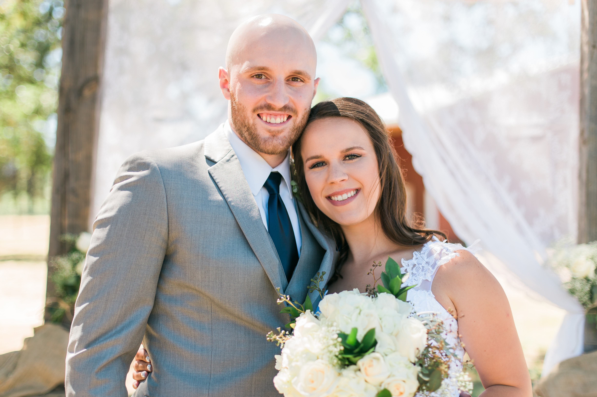
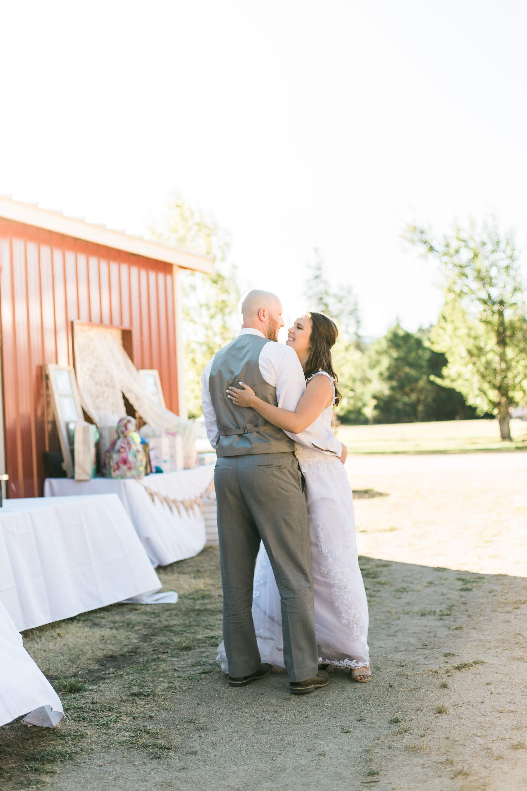
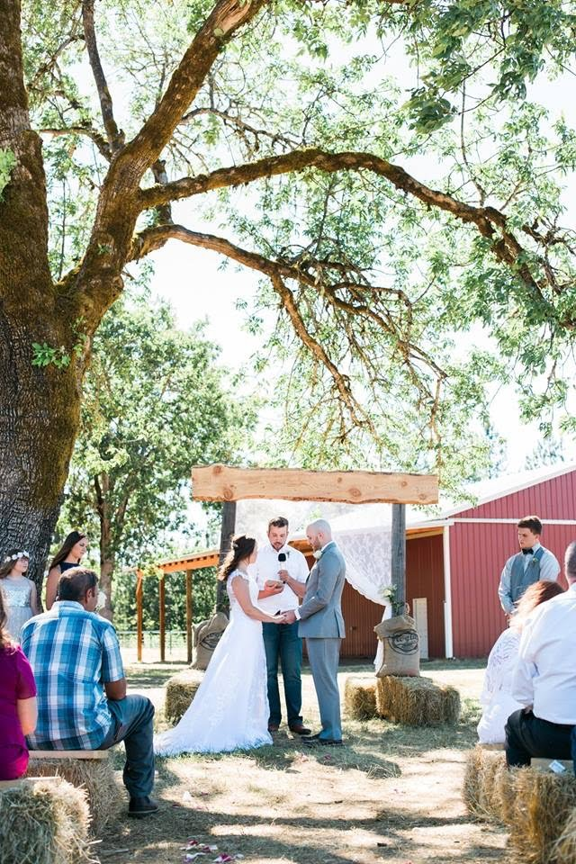
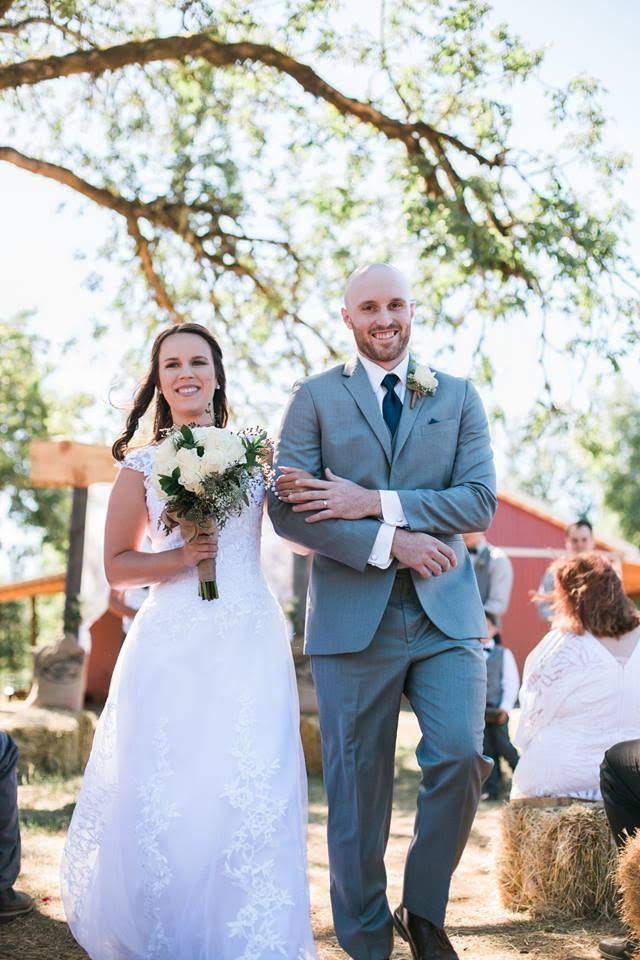
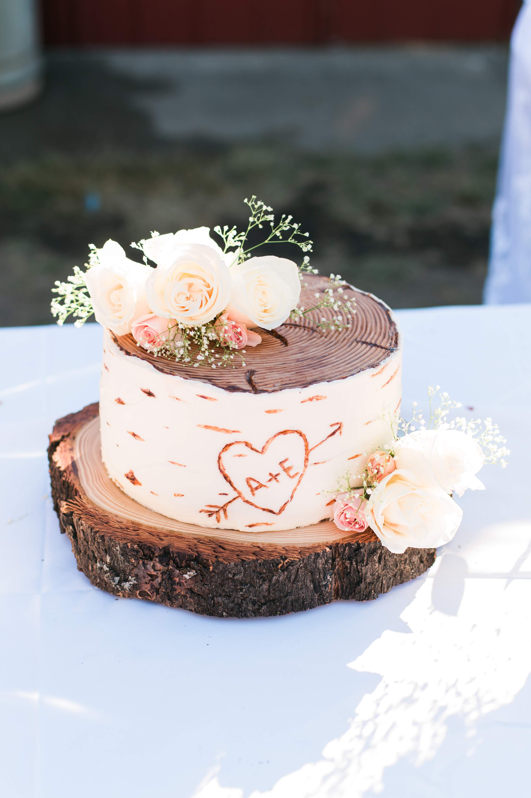
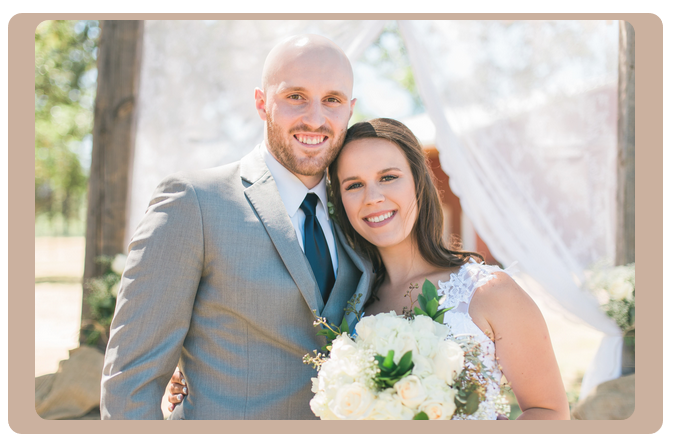

# Software Engineering Homework

## Homework 1

For this homework we are tasked to learn and apply our current fundamental knowledge of HTML, CSS, and Git. We are also tasked
to use bootstrap for help in creating a decent looking website. Below are the following links to the assignment, repository, and the demo of the website.

1. [Assignment](http://www.wou.edu/~morses/classes/cs46x/assignments/HW1.html)
2. [Repository](https://github.com/ABergman7/ABergman7.github.io)
3. [Demo](/Home.html)

### Git

Our first task was to setup a git profile, and then setting up our repository. From there, we then downloaded the git command line
and then cloned our repository to our machine. The following is the code for the setup on the current system.

```bash

cd Desktop/HW460
mkdir repos
cd repos
git clone https://github.com/ABergman7/ABergman7.github.io.git
cd ABergman7.github.io

git config --global user.email "abergman15@wou.edu"
git config --global user.name "ABergman7"
```

After setup I added a "hello world" echo to the index.html folder. I eventually edited it, but for now I just wanted to push my initial commit.

```bash
echo "Hello World" > index.html
git add --all
git commit -m "Initial commit"
git push -u origin master
```

### HTML
Below is the HTML of my home webpage with Bootstrap (no absolute path to any webpages) and the Navbar that includes links to two other webpages.
```html
<!DOCTYPE html> 
<html lang= "en"></html>
<head>
    
    
    <meta name="viewport" content="width=device-width, initial-scale=1">
    
    <title>Austin Bergman</title>
    
    <!--------------------------------bootstrap------------------------------------>
    
    <!-- Latest compiled and minified CSS -->
    <link rel ="stylesheet" href="../css/bootstrap.min.css">
    <!------------------- CSS ----------------------------------------->
    <link rel="stylesheet" type="text/css" href="Style.css">
    
    </head>
    
    <body>
        <div class="header">
                <h1>Austin and Erin's Wedding</h1>
                
            </div>
          
                <nav class="navbar navbar-expand-sm bg-dark navbar-dark justify-content-center">
                    <ul class="navbar-nav">
                        <li class="nav-item active">
                            <a class="nav-link" href="Home.html">Home</a>
                        </li>
                        <li class="nav-item">
                            <a class="nav-link" href="Photos.html">Photos</a>
                        </li>
                        <li class="nav-item">
                            <a class="nav-link" href="RSVP.html">RSVP</a>
                        </li>
                    </ul>
            </nav>
        
    
        <div class="pagebackground">
            <div class="container">
                <div class="content">   
                <p>This is the homepage of my demo to Homework 1. Prior to our wedding I promised my wife that I'd make a website to handle our wedding stuff. Well I'm a bit late, but nonetheless I was still interested in making it.</p>
                </div>    
            </div>    
            
        </div>
</body>
```
### Multicolumn
What I wanted for the second page was to have one big picture at the top followed by a two columns of other pictures. The html code for that is below:

```html
 <div class="row">     
           <div class="container">
               <div class="content">
               <div class="row">
               <div class="col">    
                


                </div>
                </div>
                </div>
          </div>
    
        <div class ="col-md-6">
         <div class ="content">    
                 
            </div> 
            </div>
        
         <div class ="col-md-6">
         <div class ="content">    
                 
            </div> 
            </div>
         <div class ="col-md-6">
         <div class ="content">    
                 
            </div> 
            </div>
           <div class ="col-md-6">
         <div class ="content">    
                 
            </div> 
            </div>
        </div>
```
As for the styling I wanted to but a colorful "rustic" kind of color only around content to my choosing. So I made the container class in CSS in order to help make things stand out more. 

Below is the overall code that I used for my style.css:

```CSS


body{
    background-color: #ffffff;
    text-decoration: none;
    color:  #07090f;
    
}


#header{
    text-align: center;
    background-color: darkgrey;
    color: #eaf2f2; 
}


.container-fluid{
    width: 75%;
    background-color: #c6a995; 
}
img{
    width: 100%;
    height: auto;
    border-color: #c6a995;
    border-radius: 10px;
}
.content{
    padding-left: 20px;
    padding-right: 20px;
    padding-top: 5px;
    padding-bottom: 10px;
    background-color: #c6a995;
    border-radius: 10px;
    margin: 20px;
    opacity: .91;
}


```
Here is what the concept of the design looks like:


Overall I think that the website looks clean and simple which was the overall idea that I wanted. I know that there is much more that I could do, but for starting out I feel pretty proud of it.

