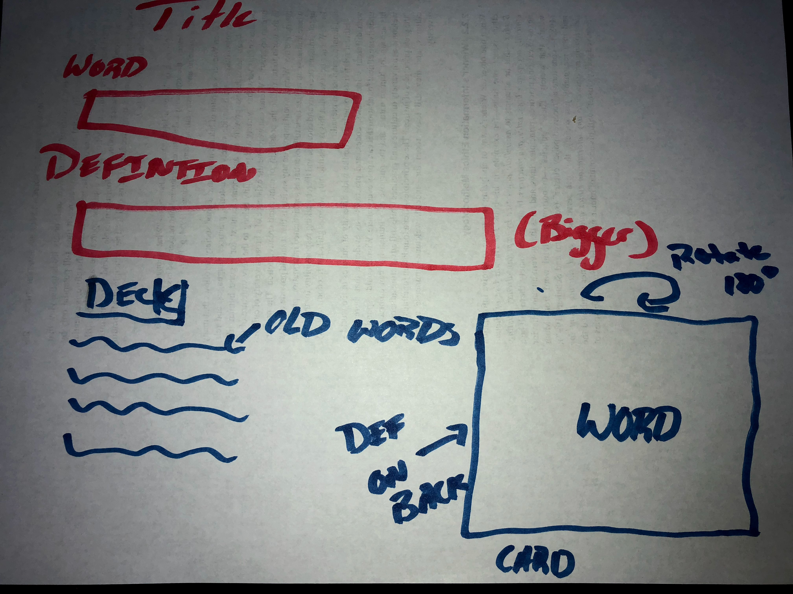

# Software Engineering Homework


## Homework 2

For this homework we are tasked to use our knowledge from HTML, CSS, and Git and apply our recent knowledge of Javascript and JQuery to make a unique website that takes in input from a user and provides an output. The creativity of our website is in our hands...

1. [Assignment](http://www.wou.edu/~morses/classes/cs46x/assignments/HW2.html)
2. [Repository](https://github.com/ABergman7/ABergman7.github.io/tree/master/HW2)
3. [Demo](/index.html)

## First Step: Planning
Here is a rough sketch of the site that I wanted:



I wanted a small simple sight that made a flash card for a student to make to help study.

## Git branching
For this assignment we were tasked with practicing branching and merging. For that I made an entire branch and named HW2. After I branched I immediately checked out to master and added a commit in order to set up master when I was ready to merge HW2 over.

The mistake that I made was that before hand, I went ahead and made everything and mthen merged before progressing master. So I restarted and did things correctly. (I still held on to the files)

Here is the code for the branching: ( I will show the mergin code at the end)

```bash
git branch HW2
git checkout master
git checkout HW2
git status 
git add . 
git commit -m "Fixed HW2 branch (not a fastforward)"
git push origin HW2
git checkout master
git add .
git commit -m "setting up merge for hw2"
git push origin master


```


## Html and CSS

As for the styling, I made to two special classes for the card and for the deck.
the deck is just a list that I needed to use to hold older words. The cards, on the other hand, had a special animation that made them rotate in on hover just a normal flipcard.
```css
.card{
    perspective: 10000px;
    width 10rem;
    height: 10rem;
    border-radius: 5px solid #f1f1f1;
    margin: 20px;
    background-color: transparent;
}
.card-inner{
    position: absolute;
    width: 100%;
    height: 100%;
    text-align: center;
    transition: transform 0.8s;
    transform-style: preserve-3d;
}

.card:hover .card-inner {
    transform: rotateY(180deg);
    
}

.card-front, .card-back {
    position: absolute;
    width: 100%;
    height: 100%;
    backface-visibility: hidden;
    
}
.card-front{
    background-color: #f0f0f0;
    text-decoration: underline;
    color: black;
        
}
.card-back{
    background-color: lightgrey;
    color: black;
    transform: rotateY(180deg);
}


deck{
    margin-left: 30px;
    font-size: 18px;
}

```

As for the HTML. I had to set up a form to take in two things: a Word and a definition. Before the </body> tag I put the script tag for my javascript.

Here is the html:
```html

    <body>
        
        <!--Header--->
            <div class="container-fluid">
             <div class="header">
                <h1>Study Buddy</h1>
                </div>
            </div>
        <div class="container-fluid">
            <p> This is a flash card website to help you study!</p>
        
        
        </div>
        
        <div class="row">
            <div class="add-form">
                <form>
                <!--Form to add a word---->
                <h3>Word: </h3>
                <input type="text" name="word" id="wordInput"> <br/>                 <h3> Definition: </h3>
                    <input type="text" name="definition" id="defInput" style="width: 500px; height: 200px"><br/>
                    <button onclick="addNewCard(); return false;" type="submit" class="btn btn-primary">Submit</button>
                </form>
                
            </div> 
           
            <!-- Shell for the deck to go ---->
            <div class="container">
                <h2>Previous Cards:</h2>
            <div class="deck" id="deckIn">   
            </div>
                </div>
            <!-- Shell for the card to go --->
            <div class="col-md-6">
                <div class="card">
                    <div class="card-inner" id="CardIn"></div>
                </div>
            </div>
        </div>
        <script src="https://code.jquery.com/jquery-3.2.1.min.js"></script>
         <script src="/js/bootstrap.bundle.min.js"></script>
        <script src="main.js"></script>
       
       
    
        
    </body>

```
## Javascript and JQuery

In my Javascript I wrote a function that takes the input from the form and does two things:

1. Make a card from the word and the definition
2. Add the word to a stack, I named the stack deck in this case.


I used JQuery to make the appends to the shells for the deck and the card which made it easier to write everything in one function. Here is the code for my Javascript:

```js

var deckList = [];
function addNewCard() {
    /* Get the input of the word and definitions */
    var word = document.getElementById('wordInput').value;
    var define = document.getElementById('defInput').value;
    
    deckList.push({
        wordL: word,
        definL: define
    });
    
    console.log(deckList);
    

    
    /* Check if the user put in a word or definition*/    
    if(word.length == 0 ){
        alert("Can't submit a blank card");
        return;
    }
    else if (define.length == 0){
        alert("You must submit a definition for your word");
        return;
    }
    else {

        /* Use JQuery to make a flash card and add to the deck*/
       $(".card").append("<div class='card-inner'><div class='card-front'><h1>"+word+"</h1></div><div class='card-back'><h2>"+define+"</h2></div></div>");
        $('#tableIn').append("<tr><td>"+word+"</td></tr>");
        
        
    }
 }


```

Now since everything is all done, it's time to merge the HW2 branch back into master

```bash
git add .
git commit -m "Site is up and running not designed well though"
git push origin HW2
git checkout master
git merge HW2 -m "Merge branch 'HW2'" 
git push origin master
```

Finally, here is a snap shot of my log graph after I have finished the project.


