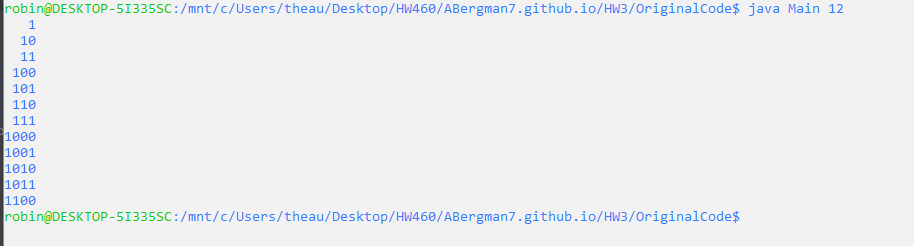

# Software Engineering Homework


## Homework 3


For this homework we are tasked with downloading and setting up Visual Studios Community edition, followed with translating a Java program to C#. This particular program does a binary translation of a given integer n, and print the value in binary as well as the binary values of previous integers before n. The inportance of this this project was to learn C# and it's similarities, but also it differences, from Java.

1. [Assignment](http://www.wou.edu/~morses/classes/cs46x/assignments/HW3_1819.html)
2. [Repo](https://github.com/ABergman7/ABergman7.github.io/tree/master/HW3)


## Installing Visual Studios

I took the liberty of not only installing the .NET desktop development workload but as well as some of the other workloads that I think I will need for web development later on. For example, the Node.js development.

## The Java Program

 I used the Eclipse IDE that I already had for Java programming from previous classes. I ran the program, however, from the command line since I am a bit more comfortable with compiling and running programs from there. Here is an example of the Java code executing: 
 
 
 
## .gitignore
 
 Since there are quite a bit of things popping while working with visual studios, we were tasked with making a .gitignore. That way we could see the actual code that we were working during our commits, rather than all of the adjustments and compilations from visual studios.
 
## Translating
 
 It's important to note that before I started I went and took a look at the [Naming Guidlines](https://docs.microsoft.com/en-us/dotnet/standard/design-guidelines/naming-guidelines) and the [Code Conventions](https://docs.microsoft.com/en-us/dotnet/csharp/programming-guide/inside-a-program/coding-conventions) prior to translating. 
 
 After reviewing the code I began to hammer out the Node class. Below is the java code and the translation to C#.
 
### Java:
 ```java
    /** Singly linked node class. */

    public class Node<T>
    {
	   public T data;
	   public Node<T> next;
	
	   public Node( T data, Node<T> next )
	   {
		  this.data = data;
		  this.next = next;
	   }
    }

```
### C#
```csharp
    /// <summary>
    /// The class for the Node
    /// </summary>
    /// <typeparam name="T"></typeparam>
    public class Node<T>
    {
        public T data;
        public Node<T> next;

        /// <summary>
        /// Setting up the Node with the inputs
        /// </summary>
        /// <param name="data"></param>
        /// <param name="next"></param>
        public Node(T data, Node<T> next)
        {
            this.data = data;
            this.next = next;
        }
    }
```
Not too much of a difference here, and as a person coming from a Java background it was bit relieving. What is nice to note here is the XML is incredibly handy and easy to use for documentaiton all it takes to generate is the typing /// for a short cut!


Well enough of the similarities lets look at the differences! I specific class that I want to talk about is the LinkedQueue class, and to save space lets look at the push() method.

### Java

    ```java
    public T push(T element)
	   { 
		  if( element == null )
          {
			 throw new NullPointerException();
		  }
		
		  if( isEmpty() )
		  {
			 Node<T> tmp = new Node<T>( element, null );
			 rear = front = tmp;
		  }
		  else
		  {		
			 // General case
			 Node<T> tmp = new Node<T>( element, null );
			 rear.next = tmp;
			 rear = tmp;
          }
        return element;
	}

    ```
### C#

    ```csharp
    public T Push(T element)
    {
        if (element == null)
        {
            throw new NullReferenceException();
        }
        if (IsEmpty())
        {
            Node<T> tmp = new Node<T>(element, null);
            rear = front = tmp;
        }
        else
        {
            Node<T> tmp = new Node<T>(element, null);
            rear.next = tmp;
            rear = tmp;
        }
        return element;
    }
    ```
Let's start with the the name of the method. In C#'s naming conventions we have, it is important for programmers to name their methods,  Classes, Interface's with captal letters. As stated from our naming conventions guide it states "This distinguishes type names from methods"
    


 
 
 