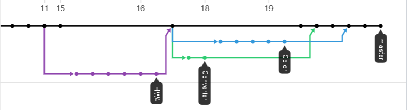

# Software Engineering Homework
## Homework 4


For this Homework assignment we were tasked with creating a MVC 5 application with two features. One being a mile metric converter, the other being a Color mixer. We were also tasked with branching the two features and then merging them in order to practice handling merge conflicts. 

1. [Assignment](http://www.wou.edu/~morses/classes/cs46x/assignments/HW4_1819.html)
2. [Repo](https://github.com/ABergman7/ABergman7.github.io/tree/master/HW4)
3. [Video](https://youtu.be/9FEFEyd3XP8)

## Branching
For this home work we were tasked with making two branches. One for the mile converter, and one for the Color mixer. Before I branched the two features I made a initial branch that created the homework foulder and the MVC files that I needed the for the project, and then merged that branch back into master Here is a visual of what that looks like:




## Mile to Metric Converter

For the mile to metric converter we had to use the HomeController for the ActionResult. Note that even though this is useing a form, the Converter action is being using a GET call.

```csharp
 [HttpGet]
        public ActionResult Converter()
        {
            string mileIn = Request.QueryString["mile"];
            string selectedMeasure = Request.QueryString["measure"];

            //Check for bad input 
            if (mileIn != null)
            {
                double result = 0;
                double mile = Convert.ToDouble(mileIn);

                //Check for which radio button was selected
                switch (selectedMeasure)
                {
                    case "Millimeter":
                        result = mile * 1609344;
                        break;
                    case "Centimeter":
                        result = mile * 160934;
                        break;
                    case "Meter":
                        result = mile * 1609.34;
                        break;
                    case "Kilometer":
                        result = mile * 1.60934;
                        break;
                }

                Debug.WriteLine(selectedMeasure);
                Debug.WriteLine(result);

                //Fancy string for output
                ViewBag.Answer = "The conversion from "+mileIn+ " mile(s) to " + selectedMeasure + "s is:" + Convert.ToString(result)+" " +selectedMeasure+"s";
            }
            return View();
```

## Color Mixer

For the color mixer we had to create a different controller and different view. Then from there, we had to use Razor helper methods to make the form for the input. Then in the controller convert the input in to Color types and mix the two colors. Here is what the view and controller look like

### Color View
```csharp
@{
    ViewBag.Title = "Create";
}

<h2>Color Converter</h2>

<!--Useing razor to create HTML form-->
@using (Html.BeginForm("Create", "Color", FormMethod.Post))
{
    //Label for Text box 1
    @Html.Label("FirstColor", "FirstColor")
    <p>Please use ARGB hex values like: #ABABABAB Note: Hex values are in order as: RGBA, i.e, the first two digits are red.</p>
    //TextBox 1 parameters
    @Html.TextBox("ColorOne", "",  new { @class = "form-control", @placeholder = "#FFFFFFFF", @type = "string", @pattern="#[0-9A-Z]{8}"})


    // Label for Text box 2
    @Html.Label("SecondColor", "SecondColor")
    //TextBox2 Parameters 
    @Html.TextBox("ColorTwo", "", new { @class = "form-control", @placeholder = "#FFFFFFFF", @type = "string", @pattern ="#[0-9A-Z]{8}"})
    
    <button type="submit" class="btn btn-default">Submit</button>
}

```

### Color Controler
 (Note that I was using System.Windows.Media library)
```csharp


        /// <summary>
        /// The HTTP Get ActionResult for the Create page
        /// </summary>
        /// <returns>view for Create.cshtml</returns>
        // GET: Color
        [HttpGet]
        public ActionResult Create()
        {
            return View();
        }

        /// <summary>
        /// After POST take color strings from form and convert to color for addition
        /// </summary>
        /// <param name="ColorOne"></param>
        /// <param name="ColorTwo"></param>
        /// <returns>View with new color plus first and second color</returns>
        [HttpPost]
        public ActionResult Create(string ColorOne, string ColorTwo)
        {
            Color colorOne = (Color)ColorConverter.ConvertFromString(ColorOne);
            Color colorTwo = (Color)ColorConverter.ConvertFromString(ColorTwo);

            Debug.WriteLine(colorOne);
            Debug.WriteLine(colorTwo);

            //Add the two colors
            Color newColor = Color.Add(colorOne,colorTwo);


            Debug.WriteLine(newColor);

            //Return all three colors in their own ViewBag
            ViewBag.NewColor = newColor;
            ViewBag.ColorA = colorOne;
            ViewBag.ColorB = colorTwo;
           
            return View();


        }
    }
}

```
the Sytem.Windows.Media reference uses the Add method which is a nifty method. Instead having to type multiple if statements to check to see if a specific rgb value was greater than 255 the Add method does the check for us. So after the conversion the new color could then be added to a ViewBag


